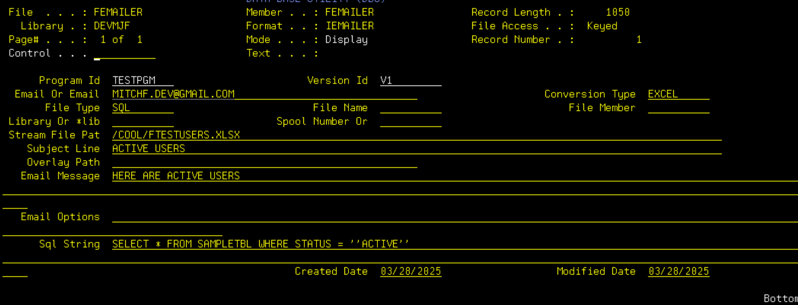

# CoolSpool_email_wrapper
 this allows you to store coolspool command parameters so you can dynamically change the parameters without recompile or create quick automated reports when combined with robot sceduler.
example usage :
we have table sampletbl that contains users. we want to gather a report of the active users and send it to our email. Say you have a query your using to identify this
SELECT * FROM sampletbl WHERE status = 'Active'
we then would setup femailer with the following parameters

then we would call pemailer with the following key parms
Call Pemailer Parm('TESTPGM' 'V1')
and this is the result
3
